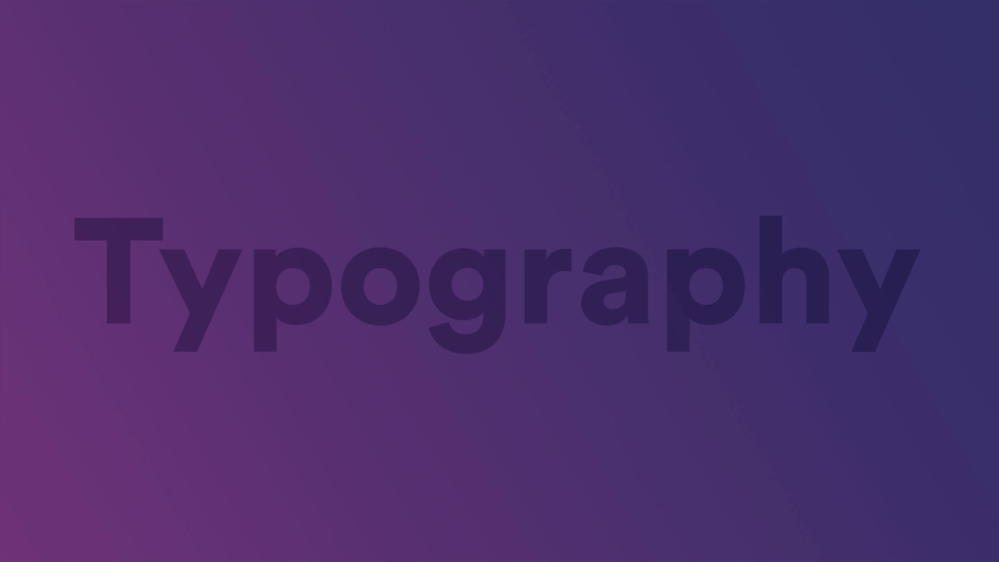

<div class="wrapCover">
    <figure class="coverBackground showAfter">
        <div class="background typographyCover"></div>
    </figure>
    <figure class="coverImage showCover">
        
    </figure>
</div>

<div class="fonts flex-row-between-center-center">
    <div class="fonts flex-column-center-center-center">
        <p class="circular font-circularBook">Circular</p>
        <p class="circular font-circularMedium">Circular</p>
        <p class="circular font-circularBold">Circular</p>
        <p class="circular font-circularBlack">Circular</p>
    </div>
    <div class="fonts flex-column-center-center-center">
        <p class="roboto font-robotoThin">Roboto</p>
        <p class="roboto font-robotoRegular">Roboto</p>
        <p class="roboto font-robotoBold">Roboto</p>
        <p class="roboto font-robotoBlack">Roboto</p>
    </div>
</div>

## Titles Circular

Example:
<h1 class="circular">h1 Heading <small>(50px)</small></h1>
<h2 class="circular">h2 Heading <small>(45px)</small></h2>
<h3 class="circular">h3 Heading <small>(35px)</small></h3>
<h3 class="circular">h4 Heading <small>(25px)</small></h4>

Code:
```html
<h1 class="font-circularBold">h1 Heading</h1>
<h2 class="font-circularBold">h2 Heading</h2>
<h3 class="font-circularBold">h3 Heading</h3>
<h3 class="font-circularBold">h4 Heading</h4>
```

## Titles Roboto

Example:
<h1 class="roboto">h1 Heading <small>(50px)</small></h1>
<h2 class="roboto">h2 Heading <small>(45px)</small></h2>
<h3 class="roboto">h3 Heading <small>(35px)</small></h3>
<h3 class="roboto">h4 Heading <small>(25px)</small></h4>

Code:
```html
<h1 class="font-robotoBold">h1 Heading</h1>
<h2 class="font-robotoBold">h2 Heading</h2>
<h3 class="font-robotoBold">h3 Heading</h3>
<h3 class="font-robotoBold">h4 Heading</h4>
```